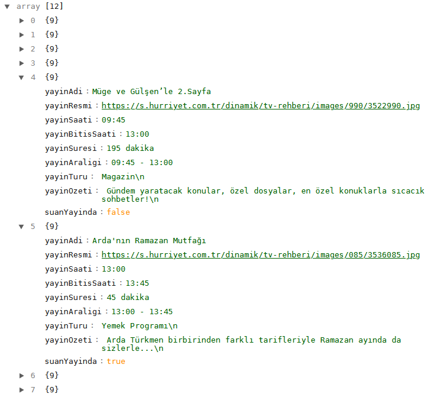

<h1>TV Yayın Akışı Getirici</h1>

TV kanallarından herhangi birinde yayınlanan programların listesini getirmeye yarayan küçük bir PHP scriptidir. Bu scripti <a href="https://canlitv.eu">Canlı TV</a> web siteme tv yayın akışını ekleyebilmek için geliştirdim.

Yayın akışını alabilmek için kaynak olarak Hürriyet'in web sitesini kullandım. Sitede yayınlanan TV yayın akışı kısmından verileri çekiyorum.

$kanalList ile belirlediğim url yapılarından getiriyor onu arada bir kontrol edersiniz.

<h2>Örnek</h2>

Basitçe şöyle kullanabilirsiniz:

<code language="php">
	$yayinlar = yayinAkisi("kanal-d");
 </code>
 

 <code language="php">
	print_r(json_encode($yayinlar["yayinAkisi"]));
</code>
 
Çıktısı şu şekilde:

Şu anda yayında olan tv programının "suanYayinda" değeri true olarak işaretlenir. Oradan siz yayında olan programı şeyaparsınız. Hadi kolay gelsin!

<h2>Desteklediği Kanallar</h2>
<ul>
<li>Kanal D</li>
<li>CNN Türk</li>
<li>Star TV</li>
<li>Show TV</li>
<li>ATV</li>
<li>TRT 1</li>
<li>NTV</li>
<li>Fox</li>
<li>TV 8</li>
<li>Sky 360</li>
<li>Bloomberg HT</li>
<li>A Haber</li>
<li>Kanal 7</li>
<li>24 Tv</li>
<li>HaberTürk</li>
<li>Beyaz TV</li>
<li>Animal Planet</li>
<li>Discovery Channel</li>
<li>Nat Geo People</li>
<li>Nat Geo Wild</li>
<li>BBC World</li>
<li>Sinema TV</li>
<li>Euro Sport 1</li>
<li>Euro Sport 2</li>
<li>National Geographic</li>
<li>Bein Sports 1</li>
<li>Sports TV</li>
<li>Teve 2</li>
<li>Bein Sports 3</li>
<li>DMAX</li>
</ul>
